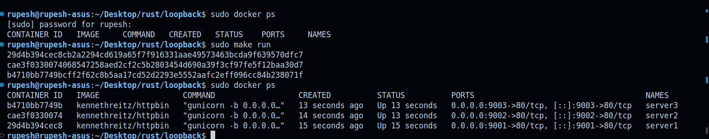
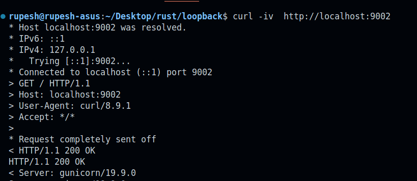
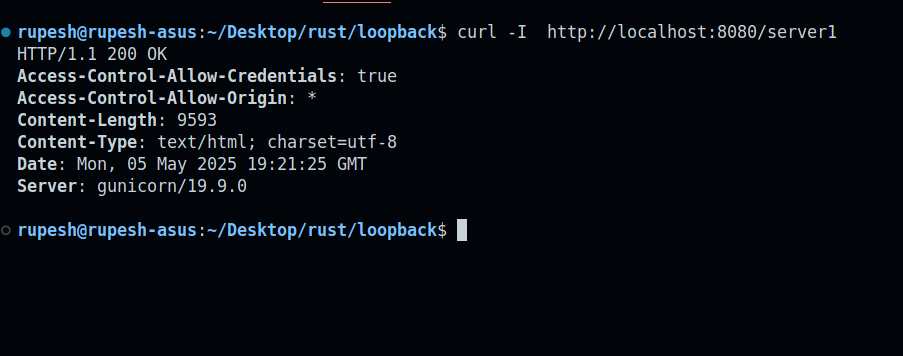
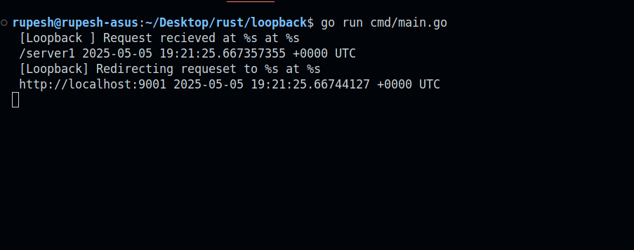

# Loopback - A Basic Reverse Proxy Server in Go

A simple reverse proxy server implementation in Go that forwards requests to multiple backend servers based on configuration.

## Features

- Configuration-driven proxy routing
- Support for multiple backend servers
- Health check endpoint
- Docker-based demo setup

## Getting Started

### Prerequisites

- Go 1.23 or higher
- Docker
- Make

### Configuration

The proxy server is configured via `data/config.yaml`. Example configuration:

```yaml
server:
  host: "localhost"
  listen_port: "8080"
  scheme: http

resources:
  - name: Server1
    endpoint: /server1
    destination_url: "http://localhost:9001"
  - name: Server2
    endpoint: /server2
    destination_url: "http://localhost:9002"
  - name: Server3
    endpoint: /server3
    destination_url: "http://localhost:9003"
```

## Usage

### Starting Demo Servers

First, run the backend demo servers using:

```bash
make run
```

The result should look like this:


### Testing Individual Servers

Testing server 1:
```bash
curl -iv http://localhost:9001
```


Testing server 2:
```bash
curl -iv http://localhost:9002
```


Testing server 3:
```bash
curl -iv http://localhost:9003
```


### Testing Proxy Server

Check if the proxy server is running:
```bash
curl -I http://localhost:8080/server1
```


The server logs should look like this:


## Makefile Commands

- `make run`: Start the demo HTTP services (Docker containers)
- `make stop`: Stop all running containers
- `make run-proxy-server`: Start the proxy server
- `make help`: Display available commands